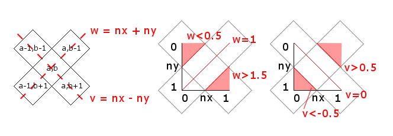

# Isometric RPG tests

## Getting started
Javascript requires the [file-server.js](./file-server.js) to be running as a Nodejs server to server up the static level json files. In a console, run
```bash
node file-server.js
```

## Math
tldr; here is the code in javascript
```javascript
// Inputs: x,y are screen coordinates
function getTileIndex(x,y) {
    // Offset x,y so 0,0 is center of top-left corner tile.
    // This is done to avoid having unrendered gaps on the top and left edges 
    var offsetX = x + tileWidthHalf;
    var offsetY = y + tileHeightHalf;
    var gridX = Math.floor(offsetX / tileWidth);
    var gridY = Math.floor(offsetY / tileHeight) * 2;
    var normalisedX = (offsetX % tileWidth) / tileWidth;
    var normalisedY = (offsetY % tileHeight) / tileHeight;
    // Couldn't think of a better name for these variables. refer to diagram below.
    // The following adjusts the grid x,y indices depending on which side of the tile
    // The screen x,y fall on, doing nothing if it is completely inside the tile.
    var w = normalisedX + normalisedY;
    if (w < 0.5) { --gridX; --gridY; }
    else if (w > 1.5) { ++gridY; }
    else {
        var v = normalisedX - normalisedY;
        if (v < -0.5) { --gridX; ++gridY; }
        else if (v > 0.5) { --gridY; }
    }
    return { x: gridX, y: gridY };
}
```

The above assumes you have tiles layed out like the following


The first calculation of grid x,y are to map the screen x,y coordintes to the following tiles


Once you have the coordinates of the fully encapsulated tile you an work out if the x,y coordinates sit inside the tile and adjust using the following if they sit outside the tile. To do this, it is easier to normalise the coordinates relative to the tile to make the math easier


Once normalised, you can work out whether you fall outside the tile into the adjacent tiles by checking the values of the the normalied `nx+ny` is between 0.5 and 1.5 and `nx-ny` is between -0.5 and 0.5



## Rendering
Experimented with 2 rendering methods here
1. html/css
1. canvas/images

For html/css, there are 2 different version. One where objects (e.g. trees) are images, and one where they are purely css. Both worked for the most part but applying css filters (e.g. to make certain sectons transparent) to large amounts of divs caused brief moments of visible lag in Chrome.

Canvas/images needed to set up a render cycle, which the pure html/css version didn't really need, but the performance was better. Because the render cycle is drawing every tile each cycle, applying transformations within that cycle doesn't add too much time, though the use of canvas filter transformations (e.g. to increase or decrease brightness of tiles) was quite laggy. But pre-rendered images would solve that.